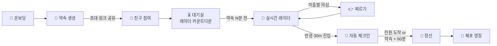
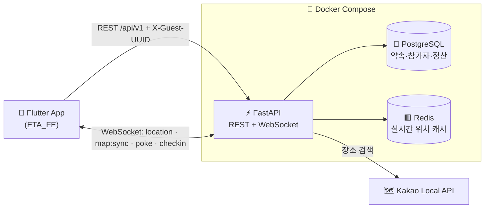

<div align="center">

# 📍 이따 (ETA) Backend

**"아직 침대면서 '지금 가는 중'이라고 거짓말하는 친구들을 검거하는 실시간 약속 지각 방지 플랫폼"**

실시간 위치 공유 · 미출발 찌르기 · 자동 도착 체크인 · 지각비 정산 · 지각 체포 영장

[](https://github.com/gomoboo/ETA_BE/actions/workflows/ci.yml)


[빠른 시작](#-빠른-시작) · [API 한눈에 보기](#-api-한눈에-보기) · [프론트 연동 가이드](docs/FRONTEND_INTEGRATION.md) · [DB 스키마](docs/DB_SCHEMA.md) · [Frontend 레포](https://github.com/gomoboo/ETA_FE)

</div>

---

## ✨ 핵심 기능

| | 기능 | 설명 |
|:---:|---|---|
| 🙋 | **간편 온보딩** | 회원가입 없이 기기 UUID로 바로 시작 (`X-Guest-UUID`) |
| 📅 | **약속 만들기 & 초대** | 카카오 장소 검색으로 목적지 설정, 6자리 초대 코드·링크 발급 |
| 📡 | **실시간 레이더** | 약속 N분 전부터 참가자 위치·거리·예상 도착 시간 실시간 공유 (WebSocket) |
| 👉 | **미출발 찌르기** | 같은 자리에 5분 이상 머문 "미출발 의심" 친구를 찔러서 출발 독촉 |
| 📍 | **자동 체크인** | 목적지 반경 **30m** 진입 시 자동 도착 처리 (일찍 / 정시 / 지각 판정) |
| 💸 | **지각비 정산** | 벌칙 모드 또는 분당 지각비 모드로 참가자별 지각비 자동 계산 |
| 🚨 | **지각 체포 영장** | 지각자 전원에게 죄명·판결문("찌르기 N회 무시 검거")이 담긴 영장 발부 |

---

## 🔄 서비스 흐름



---

## 🏗 아키텍처



| 영역 | 기술 |
|---|---|
| **Backend** | Python 3.12, FastAPI, Uvicorn, Pydantic v2 |
| **Database** | PostgreSQL 16 (운영) / SQLite (로컬·테스트), SQLAlchemy 2.0 Async, Alembic |
| **Real-time** | WebSocket, Redis (참가자 위치 캐시) |
| **External** | Kakao Local API (장소 검색) |
| **DevOps** | Docker Compose, GitHub Actions (ruff · pytest · PostgreSQL 마이그레이션 · Docker 빌드) |

---

## 🚀 빠른 시작

### 🐳 Docker (추천)

API + PostgreSQL + Redis를 한 번에 실행합니다. 시작할 때 DB 마이그레이션이 자동으로 적용됩니다.

```bash
cp .env.example .env              # 카카오 장소 검색을 쓰려면 KAKAO_REST_API_KEY 입력
docker compose up -d --build
```

| 주소 | 설명 |
|---|---|
| http://localhost:8000/docs | 📖 Swagger API 문서 |
| http://localhost:8000/health | 💚 헬스체크 |
| `ws://localhost:8000/api/v1/ws/appointments/{id}` | 📡 실시간 레이더 WebSocket |

```bash
docker compose logs -f api        # 로그 보기
docker compose down               # 종료 (데이터 유지)
docker compose down -v            # 종료 + 데이터 삭제
```

<details>
<summary><b>💻 로컬 Python으로 실행하기</b></summary>

```bash
python3 -m venv venv && source venv/bin/activate
pip install -r requirements-dev.txt
cp .env.example .env              # 기본값은 SQLite (./eta.db)
alembic upgrade head              # 테이블 생성
uvicorn app.main:app --reload --host 0.0.0.0 --port 8000
```

> 실시간 레이더(WebSocket)를 쓰려면 Redis가 필요합니다: `docker compose up -d redis`

</details>

<details>
<summary><b>⚙️ 환경 변수</b></summary>

| 변수 | 기본값 | 설명 |
|---|---|---|
| `DATABASE_URL` | `sqlite+aiosqlite:///./eta.db` | DB 주소 (PostgreSQL: `postgresql+asyncpg://...`) |
| `REDIS_URL` | `redis://localhost:6379/0` | 실시간 위치 캐시 |
| `KAKAO_REST_API_KEY` | - | 카카오 장소 검색 키 (카카오 개발자 콘솔에서 **카카오맵 사용 설정 ON** 필요) |
| `INVITE_BASE_URL` | `https://eta.app/invite` | 초대 링크 주소 |
| `SHARE_BASE_URL` | `https://eta.app` | 정산·영장 공유 링크 주소 |
| `GEOFENCE_RADIUS_METERS` | `30` | 자동 체크인 반경 (m) |
| `SETTLEMENT_TIMEOUT_MINUTES` | `60` | 약속 후 이 시간이 지나면 미도착자가 있어도 정산 (미도착자 = 이 시간만큼 지각) |
| `POKE_COOLDOWN_SECONDS` | `60` | 같은 친구를 다시 찌를 수 있는 간격 (초) |
| `DEBUG` | `True` | SQL 로그 출력 등 |

> Docker Compose에서는 `DATABASE_URL`, `REDIS_URL`이 컨테이너 내부 주소로 자동 설정됩니다.

</details>

---

## 📚 API 한눈에 보기

> 요청·응답 상세와 에러 코드, 명세에 없는 동작은 👉 **[프론트엔드 연동 가이드](docs/FRONTEND_INTEGRATION.md)**

### REST API (`/api/v1`)

모든 응답은 `{"success": true, "data": {...}}` / `{"success": false, "code": "...", "message": "..."}` 형식입니다.
🔑 표시는 `X-Guest-UUID` 헤더가 필요한 API입니다.

| ID | Method | Endpoint | 설명 | |
|---|:---:|---|---|:---:|
| API-01 | `POST` | `/users/onboarding` | 기기 등록 및 온보딩 | |
| API-02 | `GET` | `/appointments/home` | 홈 약속 목록 (진행 중 / 예정) | 🔑 |
| API-03 | `GET` | `/places/search?query=` | 장소 키워드 검색 (카카오) | |
| API-04 | `POST` | `/appointments` | 약속 생성 + 초대 코드 발급 | 🔑 |
| API-05 | `GET` | `/appointments/invite/{inviteCode}` | 초대 링크 미리보기 | |
| API-06 | `POST` | `/appointments/invite/{inviteCode}/join` | 약속 참여 | 🔑 |
| API-07 | `GET` | `/appointments/{appointmentId}` | 대기실 상세 (카운트다운, 참가자) | 🔑 |
| API-08 | `POST` | `/appointments/{appointmentId}/leave` | 약속 나가기 | 🔑 |
| API-09 | `GET` | `/appointments/{appointmentId}/settlement` | 지각비 정산 결과 | 🔑 |
| API-10 | `GET` | `/appointments/{appointmentId}/warrant` | 지각 체포 영장 | 🔑 |

### WebSocket (`/api/v1/ws/appointments/{appointmentId}?participant_id=&guestUuid=`)

메시지 형식: `{"type": "<이벤트>", ...payload}`

| ID | 방향 | type | 설명 |
|---|:---:|---|---|
| WS-01 | 📤 | `location:update` | 내 위치·속도 전송 |
| WS-02 | 📥 | `map:sync` | 전체 참가자 위치·거리·상태·누적 지각비 동기화 |
| WS-03 | 📤 | `poke:send` | 미출발 의심 친구 찌르기 (같은 친구는 60초에 한 번) |
| WS-04 | 📥 | `poke:received` | 찌르기 알림 |
| WS-05 | 📤 | `poke:respond` | 찌르기 응답 (`NOW_DEPARTING` / `DISMISSED`) |
| WS-06 | 📥 | `checkin:completed` | 반경 30m 진입 자동 체크인 |

<details>
<summary><b>📏 주요 도메인 규칙</b></summary>

| 항목 | 규칙 |
|---|---|
| 레이더 시작 | 약속 10분 / 20분 / 30분 / 1시간 전 또는 직접 설정(CUSTOM) |
| 벌칙 모드 | `PENALTY`(벌칙 문구) / `FEE`(분당 지각비) |
| 미출발 의심 | 같은 자리(반경 15m)에 5분 이상 머묾 |
| 도착 판정 | 약속 1분 전보다 일찍 → `EARLY`, 1분 이상 늦음 → `LATE`, 그 사이 → `ON_TIME` |
| 지각 시간 | 분 단위 버림 (18분 30초 → 18분), 미도착자는 60분 |
| 정산 시점 | 전원 도착 또는 약속 시간 + 60분 경과 |
| 체포 영장 | 지각자 전원에게 1장씩 발부 (지각 시간이 긴 순서), 지각자가 없으면 발부 안 함 |
| 방장 나가기 | 가장 먼저 참여한 사람에게 방장 위임, 아무도 없으면 약속 취소 |
| 초대 링크 만료 | 약속이 종료·취소됐거나 약속 시간이 지난 경우 |

</details>

---

## 🧪 테스트 & CI

```bash
pip install -r requirements-dev.txt
pytest                # 100개 테스트, 약 2초
ruff check .          # 린트
```

- 테스트마다 **임시 SQLite DB + fakeredis**를 사용해서 외부 서비스 없이 실행됩니다.
- PR과 `main`/`dev` push 시 GitHub Actions가 자동으로 검사합니다.

| CI Job | 내용 |
|---|---|
| 🧹 Lint | `ruff check .` |
| 🧪 Test | `pytest` (REST API, WebSocket, 마이그레이션, 위치 서비스) |
| 🐘 Migrations | PostgreSQL 16에서 `upgrade → downgrade → upgrade → check` |
| 🐳 Docker | 이미지 빌드 → 전체 스택 기동 → `/health` 확인 |

<details>
<summary><b>🗄 DB 마이그레이션 (Alembic)</b></summary>

```bash
alembic upgrade head                                   # 최신 상태로 적용
alembic revision --autogenerate -m "변경 내용 요약"      # 모델 변경 후 마이그레이션 생성
alembic downgrade -1                                   # 한 단계 되돌리기
```

> 생성된 파일(`alembic/versions/`)은 커밋 전에 꼭 확인해주세요. 기존 데이터가 있는 DB에서도 적용되는지(`NOT NULL` 컬럼 추가 시 `server_default`) 주의!

</details>

---

## 📁 프로젝트 구조

```text
ETA_BE/
├── app/
│   ├── main.py                  # FastAPI 앱, CORS, Redis 연결(lifespan)
│   ├── api/
│   │   ├── deps.py              # X-Guest-UUID → 현재 사용자
│   │   └── v1/endpoints/
│   │       ├── users.py         # API-01 온보딩
│   │       ├── places.py        # API-03 장소 검색
│   │       ├── appointments.py  # API-02, 04~08 약속·초대·대기실
│   │       ├── settlement.py    # API-09, 10 정산·영장
│   │       └── websocket.py     # WS-01~06 실시간 레이더
│   ├── core/                    # 설정, DB, Redis, 예외·에러 코드, WebSocket 연결 관리
│   ├── models/                  # User, Appointment, Participant, PokeLog, Warrant
│   ├── schemas/                 # 요청·응답 스키마 (camelCase)
│   └── services/                # 비즈니스 로직
│       ├── appointment_service.py        # 약속 생성, 초대 코드
│       ├── appointment_query_service.py  # 홈·상세 조회
│       ├── invite_service.py             # 미리보기·참여·나가기
│       ├── settlement_service.py         # 지각 계산, 정산, 영장
│       ├── realtime_service.py           # 위치 동기화, 찌르기, 체크인
│       ├── geo_service.py                # 거리 계산, 이동 상태, Redis 위치 캐시
│       └── kakao_place_service.py        # 카카오 장소 검색
├── alembic/                     # DB 마이그레이션
├── tests/                       # pytest (api/, 마이그레이션, 위치 서비스)
├── docs/
│   ├── FRONTEND_INTEGRATION.md  # 프론트 연동 가이드
│   ├── DB_SCHEMA.md             # DB 스키마 & 데이터 사전
│   └── CONVENTION.md            # 협업 컨벤션
├── .github/workflows/ci.yml     # GitHub Actions CI
├── Dockerfile · docker-compose.yml · docker-entrypoint.sh
└── requirements.txt · requirements-dev.txt · ruff.toml · pytest.ini
```

---

## 📖 문서

| 문서 | 내용 |
|---|---|
| 📱 [프론트엔드 연동 가이드](docs/FRONTEND_INTEGRATION.md) | 인증, 에러 코드, API별 규칙, WebSocket 흐름, Flutter 예시 코드 |
| 🗄 [DB 스키마](docs/DB_SCHEMA.md) | ERD, 테이블 정의, Enum |
| 🤝 [협업 컨벤션](docs/CONVENTION.md) | 브랜치, 이슈, 커밋, PR 규칙 |

---

## 🚧 남은 작업

- [ ] 자동 배포 (CD) — 배포 서버 결정 후 ([#14](https://github.com/gomoboo/ETA_BE/issues/14))
- [ ] AI PR 리뷰 봇 ([#15](https://github.com/gomoboo/ETA_BE/issues/15))
- [ ] FCM 푸시 (앱이 꺼져 있을 때 찌르기 알림)
- [ ] 외부 공유용 공개 조회 API, 영장 카드 이미지 생성

> ⚠️ WebSocket 연결을 서버 메모리에서 관리하므로 API는 **워커 1개**로 실행합니다. 서버를 여러 대로 늘리려면 Redis Pub/Sub 기반 브로드캐스트가 필요합니다.

---

<div align="center">

**Team gomoboo**

| 🧭 PM · 기획 · 발표 | ⚙️ Backend | 📱 Frontend |
|:---:|:---:|:---:|
| [@dy401](https://github.com/dy401) | [@Raewon12](https://github.com/Raewon12) · [@leesk0007](https://github.com/leesk0007) | [@krot118](https://github.com/krot118) |

</div>
