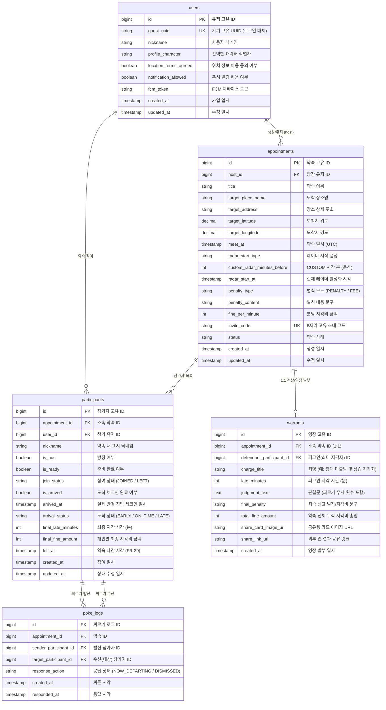

# 📍 이따 (ETA) Database Schema & Data Dictionary

> 본 문서는 **'이따 (ETA - 실시간 약속 지각 방지 플랫폼)'**의 최신 데이터베이스 스키마 정의 및 데이터 사전입니다.  
> 기획 요구사항 및 현재 구현된 백엔드 비즈니스 로직(REST API & WebSocket)과의 정합성을 모두 반영하였습니다.  
> *노션(Notion)에 그대로 복사하여 페이지 본문으로 업로드할 수 있는 마크다운 형식입니다.*

---

## 1. 개체 관계도 (ERD)

---

## 2. 테이블 상세 정의 (Data Dictionary)

### 2.1. `users` (사용자 / 게스트)
* **목적**: 회원가입 없이 기기 고유 UUID를 기반으로 사용자를 식별하고, 푸시 토큰 및 약관 동의 상태를 관리합니다.
* **관련 API**: `[API-01] 기기 등록 및 온보딩`

| 컬럼명 (Physical) | 데이터 타입 | 제약 조건 | 기본값 | 설명 및 비고 |
| :--- | :--- | :---: | :---: | :--- |
| `id` | `BIGINT` | PK, AUTO_INCREMENT | - | 사용자 고유 식별 번호 |
| `guest_uuid` | `VARCHAR(64)` | NOT NULL, UNIQUE | - | 클라이언트 기기 고유 UUID (로그인 대체) |
| `nickname` | `VARCHAR(30)` | NOT NULL | - | 사용자 기본 닉네임 (2~10자 검증) |
| `profile_character`| `VARCHAR(50)` | NULL | `char_rabbit` | 온보딩 시 선택한 캐릭터 에셋 식별자 |
| `location_terms_agreed`| `BOOLEAN` | NOT NULL | `false` | 위치 정보 이용 동의 여부 (FR-03) |
| `notification_allowed`| `BOOLEAN` | NOT NULL | `true` | 푸시 알림 수신 동의 여부 |
| `fcm_token` | `VARCHAR(255)` | NULL | - | FCM 푸시 발송용 디바이스 토큰 |
| `created_at` | `TIMESTAMP` | NOT NULL | `NOW()` | 가입/등록 일시 |
| `updated_at` | `TIMESTAMP` | NOT NULL | `NOW()` | 정보 수정 일시 |

---

### 2.2. `appointments` (약속 룸)
* **목적**: 약속 장소, 시간, 레이더 시작 설정, 페널티 룰, 초대 링크 및 약속 라이프사이클을 관리합니다.
* **관련 API**: `[API-02] 홈 약속 목록`, `[API-04] 새 약속 생성`, `[API-05] 초대 미리보기`, `[API-07] 대기실 상세`

| 컬럼명 (Physical) | 데이터 타입 | 제약 조건 | 기본값 | 설명 및 비고 |
| :--- | :--- | :---: | :---: | :--- |
| `id` | `BIGINT` | PK, AUTO_INCREMENT | - | 약속 방 고유 식별 번호 |
| `host_id` | `BIGINT` | FK (users.id), NOT NULL | - | **약속 생성자(방장) 유저 ID** *(조회 최적화)* |
| `title` | `VARCHAR(100)` | NOT NULL | - | 약속 이름 (예: 강남역 맛집 탐방) |
| `target_place_name`| `VARCHAR(100)` | NOT NULL | - | 도착 장소명 (예: 스타벅스 강남점) |
| `target_address` | `VARCHAR(255)` | NOT NULL | - | 장소 도로명 / 지번 주소 |
| `target_latitude` | `DECIMAL(10, 7)`| NOT NULL | - | 약속 장소 위도 (Latitude) |
| `target_longitude`| `DECIMAL(10, 7)`| NOT NULL | - | 약속 장소 경도 (Longitude) |
| `meet_at` | `TIMESTAMP` | NOT NULL | - | 약속 일시 (UTC 기준 저장) |
| `radar_start_type` | `VARCHAR(20)` | NOT NULL | `'30M_BEFORE'`| `10M_BEFORE`, `20M_BEFORE`, `30M_BEFORE`, `1H_BEFORE`, `CUSTOM` |
| `custom_radar_minutes_before`| `INT` | NULL | `30` | `CUSTOM` 레이더 설정 시 N분 전 값 |
| `radar_start_at` | `TIMESTAMP` | NOT NULL | - | **계산된 실제 위치 공유 시작 일시** (`meet_at - radar_minutes`) |
| `penalty_type` | `VARCHAR(20)` | NOT NULL | `'PENALTY'` | **벌칙 유형 (`PENALTY`: 고정벌칙, `FEE`: 분당지각비)** |
| `penalty_content` | `VARCHAR(100)` | NULL | - | 벌칙 내용 문구 (예: 오늘 커피 쏘기) |
| `fine_per_minute` | `INT` | NOT NULL | `0` | 1분당 지각비 금액 (원 단위, 예: 1000) |
| `invite_code` | `VARCHAR(16)` | NOT NULL, UNIQUE | - | 6자리 고유 초대 난수 코드 (예: `ETA88A`) |
| `status` | `VARCHAR(20)` | NOT NULL | `'SCHEDULED'` | 약속 상태 (`SCHEDULED`, `RADAR_ACTIVE`, `COMPLETED`, `CANCELLED`) |
| `created_at` | `TIMESTAMP` | NOT NULL | `NOW()` | 약속 생성 일시 |
| `updated_at` | `TIMESTAMP` | NOT NULL | `NOW()` | 수정 일시 |

---

### 2.3. `participants` (약속 참가자)
* **목적**: 약속에 참여한 사용자 매핑, 실시간 도착 체크인 상태 및 최종 개인별 지각비를 기록합니다.
* **관련 API**: `[API-06] 약속 참여`, `[API-08] 약속 나가기`, `[WS-01~06] 실시간 위치 및 체크인`, `[API-09] 정산`

| 컬럼명 (Physical) | 데이터 타입 | 제약 조건 | 기본값 | 설명 및 비고 |
| :--- | :--- | :---: | :---: | :--- |
| `id` | `BIGINT` | PK, AUTO_INCREMENT | - | 참가자 고유 식별 번호 (`participantId`) |
| `appointment_id` | `BIGINT` | FK (appointments.id), NOT NULL | - | 소속 약속 방 ID |
| `user_id` | `BIGINT` | FK (users.id), NOT NULL | - | 참가 유저 ID |
| `nickname` | `VARCHAR(30)` | NOT NULL | - | 약속 내 표시 닉네임 |
| `is_host` | `BOOLEAN` | NOT NULL | `false` | 방장 여부 (방장 나가기 시 위임) |
| `is_ready` | `BOOLEAN` | NOT NULL | `true` | 대기실 준비 상태 여부 |
| `join_status` | `VARCHAR(20)` | NOT NULL | `'JOINED'` | 참여 상태 (`JOINED`: 참여중, `LEFT`: 방 나감) |
| `is_arrived` | `BOOLEAN` | NOT NULL | `false` | **도착 체크인 완료 여부 플래그** |
| `arrived_at` | `TIMESTAMP` | NULL | - | 실제 반경 50m 진입 체크인 일시 (UTC) |
| `arrival_status` | `VARCHAR(20)` | NULL | - | 도착 상태 (`EARLY`, `ON_TIME`, `LATE`) |
| `final_late_minutes`| `INT` | NOT NULL | `0` | 최종 지각 시간 (분 단위 버림) |
| `final_fine_amount` | `INT` | NOT NULL | `0` | 최종 개인 지각비 금액 (원 단위) |
| `left_at` | `TIMESTAMP` | NULL | - | **약속 나가기를 누른 일시 (FR-29)** |
| `created_at` | `TIMESTAMP` | NOT NULL | `NOW()` | 약속 참여 일시 |
| `updated_at` | `TIMESTAMP` | NOT NULL | `NOW()` | 상태 갱신 일시 |

> **⭐️ 복합 고유 인덱스 제약 (Unique Constraint)**:  
> `UNIQUE KEY uk_appointment_user (appointment_id, user_id)`  
> ➡️ 동일 유저가 같은 약속에 중복 참여되는 문제를 DB 레벨에서 원천 차단합니다.

---

### 2.4. `poke_logs` (미출발 찌르기 이력)
* **목적**: 미출발 의심 참가자에게 보낸 찌르기 신호 이력 및 응답 상태를 저장합니다. (영장 판결문 자동 연동)
* **관련 WebSocket**: `[WS-03] poke:send`, `[WS-04] poke:received`, `[WS-05] poke:respond`

| 컬럼명 (Physical) | 데이터 타입 | 제약 조건 | 기본값 | 설명 및 비고 |
| :--- | :--- | :---: | :---: | :--- |
| `id` | `BIGINT` | PK, AUTO_INCREMENT | - | 찌르기 로그 고유 식별자 (`pokeId`) |
| `appointment_id` | `BIGINT` | FK (appointments.id), NOT NULL | - | 발생 약속 방 ID |
| `sender_participant_id`| `BIGINT` | FK (participants.id), NOT NULL | - | 찌른 참가자 ID |
| `target_participant_id`| `BIGINT` | FK (participants.id), NOT NULL | - | 찔림당한 대상 참가자 ID |
| `response_action` | `VARCHAR(30)` | NOT NULL | `'NO_RESPONSE'`| 응답 액션 (`NO_RESPONSE`, `NOW_DEPARTING`, `DISMISSED`) |
| `created_at` | `TIMESTAMP` | NOT NULL | `NOW()` | 찌르기 발송 시각 |
| `responded_at` | `TIMESTAMP` | NULL | - | 응답 완료 시각 |

---

### 2.5. `warrants` (지각 체포 영장 및 정산)
* **목적**: 약속 종료 후 최다 지각자에게 발부되는 판결문 카드 데이터 및 정산 총합을 저장합니다.
* **관련 API**: `[API-09] 정산 결과 조회`, `[API-10] 지각 체포 영장 및 결과 카드 조회`

| 컬럼명 (Physical) | 데이터 타입 | 제약 조건 | 기본값 | 설명 및 비고 |
| :--- | :--- | :---: | :---: | :--- |
| `id` | `BIGINT` | PK, AUTO_INCREMENT | - | 영장 고유 식별 번호 (`warrantId`) |
| `appointment_id` | `BIGINT` | FK (appointments.id), NOT NULL, UNIQUE | - | 대상 약속 ID (1:1 매핑) |
| `defendant_participant_id`| `BIGINT` | FK (participants.id), NULL | - | 피고인(최다 지각자) ID |
| `charge_title` | `VARCHAR(100)` | NOT NULL | `'침대 미출발 및 상습 지각죄'` | 죄명 (미도착자는 `'약속 장소 무단 미도착죄'`) |
| `late_minutes` | `INT` | NOT NULL | `0` | 피고인 지각 시간 (분) |
| `judgment_text` | `TEXT` | NOT NULL | - | 판결문 (예: `약속 시간 18분 초과 및 찌르기 2회 무시 검거`) |
| `final_penalty` | `VARCHAR(150)` | NOT NULL | - | 최종 집행 벌칙 문구 (예: `지각비 18,000원 납부`) |
| `total_fine_amount`| `INT` | NOT NULL | `0` | 약속 전체 참가자의 지각비 총합 |
| `share_card_image_url`| `VARCHAR(500)` | NULL | - | 공유용 결과 카드 이미지 URL |
| `share_link_url` | `VARCHAR(255)` | NULL | - | 외부 웹 결과 공유 링크 URL |
| `created_at` | `TIMESTAMP` | NOT NULL | `NOW()` | 영장 발부 일시 |

---

## 3. 핵심 열거형(Enum) 및 상태값 정의표

| 열거형 (Enum) | 허용 값 (Values) | 설명 |
| :--- | :--- | :--- |
| **`PenaltyType`** | `PENALTY` | 고정 벌칙 텍스트 수행 (예: 커피 쏘기) |
| | `FEE` | 분당 지각비 누적 납부 (예: 분당 1,000원) |
| **`AppointmentStatus`** | `SCHEDULED` | 약속 생성 완료, 레이더 시작 전 대기 |
| | `RADAR_ACTIVE` | 레이더 시작 시각 도달 (실시간 위치 공유 활성) |
| | `COMPLETED` | 정산 완료 또는 전원 도착 완료 |
| | `CANCELLED` | 방장 및 참가자 전원 퇴장으로 인한 약속 취소 |
| **`ArrivalStatus`** | `EARLY` | 약속 시간보다 일찍 반경 50m 진입 |
| | `ON_TIME` | 정시 도착 (약속 시간 이내) |
| | `LATE` | 약속 시간 초과 후 지각 도착 |
| **`MovementState`** *(웹소켓)* | `MOVING` | 정상 이동 중 (속도 > 0 km/h) |
| | `SUSPECTED_NOT_DEPARTED` | 5분 이상 속도 0 및 위치 변화 없음 (미출발 의심) |
| | `LATE` | 약속 시간 초과 상태로 이동 중 |
| | `ARRIVED` | 목적지 50m 반경 체크인 완료 |
