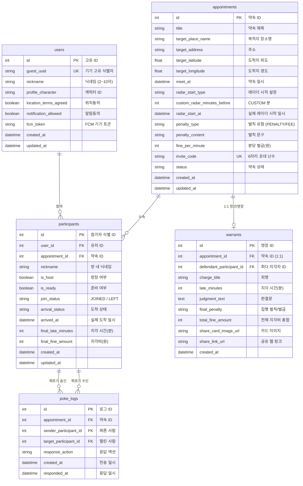

# 🗄️ 이따 (ETA) Database Schema & Data Dictionary

> 본 문서는 **'이따 (ETA - 실시간 약속 지각 방지 플랫폼)'**의 데이터베이스 테이블 정의 및 데이터 사전입니다.  
> REST API 개발자와 WebSocket 개발자가 동일한 데이터 규격을 기준으로 협업할 수 있도록 구성되었습니다.

---

## 1. 개체 관계도 (ERD)

---

## 2. 테이블 상세 정의

### 2.1. `users` (사용자/기기)
* **목적**: 회원가입 없이 기기 식별자(`guest_uuid`)를 바탕으로 유저를 식별하고 푸시 알림 토큰을 관리합니다.
* **관련 API**: `[API-01] 기기 등록 및 온보딩`

| 컬럼명 (Physical) | 타입 (Type) | Nullable | 기본값 | 설명 및 비고 |
| :--- | :--- | :---: | :---: | :--- |
| `id` | `INTEGER` | ❌ | AI (PK) | 사용자 고유 식별 번호 |
| `guest_uuid` | `VARCHAR(64)` | ❌ | - | 클라이언트 UUID (Unique Index) |
| `nickname` | `VARCHAR(20)` | ❌ | - | 사용자 기본 닉네임 (2~10자) |
| `profile_character` | `VARCHAR(50)` | ❌ | `char_rabbit` | 온보딩 시 선택한 캐릭터 ID |
| `location_terms_agreed` | `BOOLEAN` | ❌ | `true` | 위치 정보 수집/이용 약관 동의 |
| `notification_allowed` | `BOOLEAN` | ❌ | `true` | 푸시 알림 수신 동의 여부 |
| `fcm_token` | `VARCHAR(255)` | ⭕ | `NULL` | FCM 푸시 발송용 디바이스 토큰 |
| `created_at` | `DATETIME` | ❌ | `CURRENT_TIMESTAMP` | 가입/등록 일시 |
| `updated_at` | `DATETIME` | ❌ | `CURRENT_TIMESTAMP` | 정보 수정 일시 |

---

### 2.2. `appointments` (약속)
* **목적**: 생성된 약속의 목적지 좌표, 약속 시간, 레이더 시작 시각, 벌금 규칙 및 초대 코드를 관리합니다.
* **관련 API**: `[API-02] 홈 약속 목록`, `[API-04] 새 약속 생성`, `[API-05] 초대 미리보기`, `[API-07] 대기실`

| 컬럼명 (Physical) | 타입 (Type) | Nullable | 기본값 | 설명 및 비고 |
| :--- | :--- | :---: | :---: | :--- |
| `id` | `INTEGER` | ❌ | AI (PK) | 약속 고유 식별 번호 |
| `title` | `VARCHAR(100)` | ❌ | - | 약속 이름 (예: "강남역 맛집 탐방") |
| `target_place_name` | `VARCHAR(150)` | ❌ | - | 도착지 장소명 (예: "스타벅스 강남역점") |
| `target_address` | `VARCHAR(255)` | ⭕ | `NULL` | 도착지 주소 (도로명 또는 지번) |
| `target_latitude` | `FLOAT` | ❌ | - | 도착지 위도 (예: 37.497952) |
| `target_longitude` | `FLOAT` | ❌ | - | 도착지 경도 (예: 127.027619) |
| `meet_at` | `DATETIME` | ❌ | - | 실제 약속 일시 (UTC 기준) |
| `radar_start_type` | `VARCHAR(20)` | ❌ | `30M_BEFORE` | 레이더 시작 타입 (`10M`, `20M`, `30M`, `1H`, `CUSTOM`) |
| `custom_radar_minutes_before`| `INTEGER` | ⭕ | `30` | `CUSTOM`일 때 약속 N분 전 설정값 |
| `radar_start_at` | `DATETIME` | ❌ | - | **실제 레이더 활성화 시각** (meet_at - radar_minutes) |
| `penalty_type` | `VARCHAR(20)` | ❌ | `PENALTY` | 벌칙 유형 (`PENALTY`: 고정벌칙, `FEE`: 분당 지각비) ※ 2026-10-01 `FINE` → `FEE`로 변경 |
| `penalty_content` | `VARCHAR(150)` | ⭕ | `NULL` | 벌칙 내용 문구 (예: "커피 쏘기") |
| `fine_per_minute` | `INTEGER` | ❌ | `0` | 분당 지각비 (원 단위, 예: 1000) |
| `invite_code` | `VARCHAR(12)` | ❌ | - | 6자리 초대 난수 (예: `ETA99K`, Unique Index) |
| `status` | `VARCHAR(20)` | ❌ | `SCHEDULED` | 약속 상태 (`SCHEDULED`, `RADAR_ACTIVE`, `COMPLETED`, `CANCELLED`) |
| `created_at` | `DATETIME` | ❌ | `CURRENT_TIMESTAMP` | 약속 생성 일시 |
| `updated_at` | `DATETIME` | ❌ | `CURRENT_TIMESTAMP` | 수정 일시 |

---

### 2.3. `participants` (약속 참가자)
* **목적**: 유저와 약속 간의 N:M 매핑 테이블. 방장 여부, 도착 상태, 최종 지각 시간 및 지각비를 기록합니다.
* **관련 API**: `[API-06] 약속 참여`, `[API-08] 약속 나가기`, `[WS-01~06] 실시간 위치 및 체크인`, `[API-09] 정산`

| 컬럼명 (Physical) | 타입 (Type) | Nullable | 기본값 | 설명 및 비고 |
| :--- | :--- | :---: | :---: | :--- |
| `id` | `INTEGER` | ❌ | AI (PK) | 참가자 고유 식별 번호 (`participantId`) |
| `user_id` | `INTEGER` | ❌ | FK | `users.id` 참조 |
| `appointment_id` | `INTEGER` | ❌ | FK | `appointments.id` 참조 |
| `nickname` | `VARCHAR(20)` | ❌ | - | 약속 내 표시 닉네임 |
| `is_host` | `BOOLEAN` | ❌ | `false` | 방장(생성자) 여부 |
| `is_ready` | `BOOLEAN` | ❌ | `true` | 대기실 준비 상태 여부 |
| `join_status` | `VARCHAR(20)` | ❌ | `JOINED` | `JOINED`(참여 중), `LEFT`(방 나감) |
| `arrival_status` | `VARCHAR(20)` | ❌ | `NOT_ARRIVED`| `NOT_ARRIVED`, `EARLY`, `ON_TIME`, `LATE` |
| `arrived_at` | `DATETIME` | ⭕ | `NULL` | 목적지 도착 인증 완료 시각 |
| `final_late_minutes` | `INTEGER` | ❌ | `0` | 최종 지각 시간 (분) |
| `final_fine_amount` | `INTEGER` | ❌ | `0` | 최종 정산 지각비 (원) |
| `created_at` | `DATETIME` | ❌ | `CURRENT_TIMESTAMP` | 참여 일시 |
| `updated_at` | `DATETIME` | ❌ | `CURRENT_TIMESTAMP` | 상태 갱신 일시 |

---

### 2.4. `warrants` (지각 체포 영장 및 정산)
* **목적**: 약속 종료 후 최다 지각자에게 발부되는 영장 카드와 정산 결과를 저장합니다.
* **관련 API**: `[API-09] 정산 결과 조회`, `[API-10] 지각 체포 영장 및 결과 카드`

| 컬럼명 (Physical) | 타입 (Type) | Nullable | 기본값 | 설명 및 비고 |
| :--- | :--- | :---: | :---: | :--- |
| `id` | `INTEGER` | ❌ | AI (PK) | 영장 고유 식별 번호 (`warrantId`) |
| `appointment_id` | `INTEGER` | ❌ | FK (UK) | `appointments.id` 1:1 매핑 |
| `defendant_participant_id` | `INTEGER` | ⭕ | FK | 최다 지각자 `participants.id` 참조 |
| `charge_title` | `VARCHAR(100)` | ❌ | `침대 미출발 및 상습 지각죄` | 영장 죄명 |
| `late_minutes` | `INTEGER` | ❌ | `0` | 피고인 지각 시간 (분) |
| `judgment_text` | `TEXT` | ❌ | - | 판결문 요약 |
| `final_penalty` | `VARCHAR(150)` | ❌ | - | 집행 벌칙 문구 (예: "오늘 전원 커피 쏘기") |
| `total_fine_amount` | `INTEGER` | ❌ | `0` | 해당 약속 참가자 전원의 지각비 총합 |
| `share_card_image_url` | `VARCHAR(500)` | ⭕ | `NULL` | 동적 생성된 영장 카드 이미지 CDN URL |
| `share_link_url` | `VARCHAR(255)` | ⭕ | `NULL` | 외부 공유용 웹 결과 링크 |
| `created_at` | `DATETIME` | ❌ | `CURRENT_TIMESTAMP` | 영장 발부 일시 |

---

### 2.5. `poke_logs` (미출발 찌르기 이력)
* **목적**: 참가자 간 찌르기 이벤트 송수신 내역 및 응답 상태를 로깅합니다.
* **관련 WebSocket**: `[WS-03] poke:send`, `[WS-04] poke:received`, `[WS-05] poke:respond`

| 컬럼명 (Physical) | 타입 (Type) | Nullable | 기본값 | 설명 및 비고 |
| :--- | :--- | :---: | :---: | :--- |
| `id` | `INTEGER` | ❌ | AI (PK) | 로그 고유 번호 (`pokeId`) |
| `appointment_id` | `INTEGER` | ❌ | FK | `appointments.id` 참조 |
| `sender_participant_id` | `INTEGER` | ❌ | FK | 찌른 사람 `participants.id` |
| `target_participant_id` | `INTEGER` | ❌ | FK | 찔린 사람 `participants.id` |
| `response_action` | `VARCHAR(30)` | ⭕ | `NULL` | 응답 액션 (`NOW_DEPARTING`, `DISMISSED`) |
| `created_at` | `DATETIME` | ❌ | `CURRENT_TIMESTAMP` | 찌르기 발송 시각 |
| `responded_at` | `DATETIME` | ⭕ | `NULL` | 응답 시각 |

---

## 3. 핵심 열거형(Enum) 및 상태값 정의

| Enum 명 | 값 (Values) | 설명 |
| :--- | :--- | :--- |
| **`AppointmentStatus`** | `SCHEDULED` | 약속 생성 완료, 레이더 시작 전 대기 상태 |
| | `RADAR_ACTIVE` | 레이더 활성화 시점 도달 (실시간 위치 공유 진행 중) |
| | `COMPLETED` | 전원 도착 또는 모임 완료 |
| | `CANCELLED` | 약속 취소 |
| **`PenaltyType`** | `PENALTY` | 벌칙 모드: `penalty_content`에 벌칙 문구, `fine_per_minute`는 0 |
| | `FEE` | 지각비 모드: `fine_per_minute`에 분당 금액(원), `penalty_content`는 비움 |
| **`ArrivalStatus`** | `NOT_ARRIVED` | 아직 도착하지 않음 (이동 중 또는 미출발) |
| | `EARLY` | 약속 시간보다 일찍 도착 |
| | `ON_TIME` | 약속 시간 정시(±오차 범위 내) 도착 |
| | `LATE` | 약속 시간 초과 후 지각 도착 |
| **`MovementState`** *(웹소켓)* | `MOVING` | 정상 이동 중 (속도 > 0 km/h) |
| | `SUSPECTED_NOT_DEPARTED` | 미출발 의심 (일정 시간 동안 속도 0 및 거리 변화 없음) |
| | `LATE` | 지각 중 |
| | `ARRIVED` | 도착 완료 |

---

## 4. 2인 협업 개발자를 위한 사용 가이드

### 👤 개발자 A (REST API 담당)
* **약속 생성 시**:
  1. `meet_at`과 `radar_start_type`을 받아 `radar_start_at`을 자동 계산하여 `appointments` 테이블에 저장합니다.
  2. 6자리 영숫자 난수(`ETA99K` 등)로 `invite_code`를 생성합니다.
  3. 생성자를 `participants` 테이블에 `is_host=True`로 자동 등록합니다.
* **정산 시**:
  1. `participants`의 `final_late_minutes`와 `final_fine_amount`를 바탕으로 `warrants` 레코드를 생성하고 `[API-09]`, `[API-10]`으로 응답합니다.

### 👤 개발자 B (WebSocket & 실시간 엔진 담당)
* **방 진입 시**:
  1. 소켓 연결 시 넘어온 `appointment_id`로 `appointments`의 `target_latitude`, `target_longitude`, `meet_at`을 가져옵니다.
* **실시간 계산**:
  1. 클라이언트의 최신 좌표와 `appointments`의 목적지 좌표 간의 거리를 Geopy(Haversine)로 계산합니다.
  2. 목적지 50m 반경 진입 시 `participants`의 `arrival_status`를 `EARLY/ON_TIME/LATE`로 갱신하고 `checkin:completed` 이벤트를 발행합니다.
* **미출발 판별**:
  1. 클라이언트의 위치가 5분 이상 정지되어 있으면 소켓 동기화(`map:sync`) 시 `movementState="SUSPECTED_NOT_DEPARTED"`로 플래그를 붙여 전송합니다.
